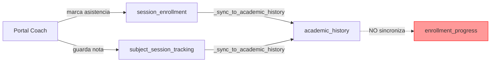
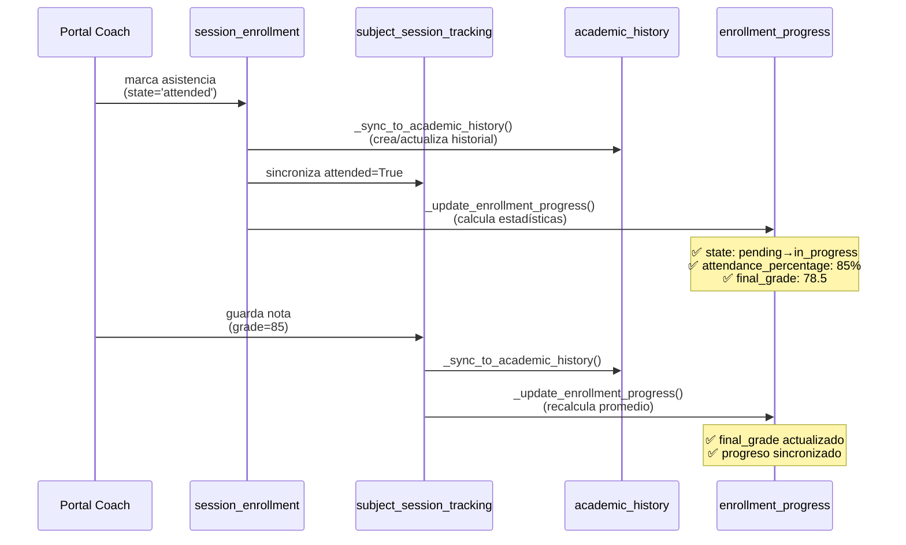

# 🔍 DIAGNÓSTICO: Inconsistencia en Persistencia de Asistencia y Progreso

**Fecha**: 8 de enero de 2026  
**Módulo**: `benglish_academy`, `portal_coach`, `portal_student`  
**Prioridad**: 🔴 CRÍTICA

---

## 📋 PROBLEMA REPORTADO

### Síntomas

1. **Asistencia NO aparece en backend**: Cuando el profesor marca asistencia en Portal Coach, esta NO aparece en:
   ```
   Backend → Estudiante → Historia Académica → Asistencia
   ```

2. **Progreso académico NO se actualiza**: El progreso del estudiante NO refleja las clases tomadas.

### Comportamiento Observado

✅ **Portal Coach → Portal Student**: FUNCIONA  
❌ **Portal Coach → Backend (Gestión Académica)**: NO FUNCIONA  
❌ **Progreso Académico del Estudiante**: NO SE ACTUALIZA

---

## 🔬 ANÁLISIS TÉCNICO

### Arquitectura del Sistema

El sistema tiene **3 modelos principales** para registrar sesiones:

1. **`benglish.session.enrollment`**: Inscripción del estudiante en una sesión
   - Guarda: `state` ('attended', 'absent', 'pending')
   - Se actualiza: ✅ desde Portal Coach

2. **`benglish.academic.history`**: Historial académico inmutable
   - Guarda: `attendance_status`, `grade`, `notes`
   - Se actualiza: ✅ automáticamente desde `session_enrollment`

3. **`benglish.subject.session.tracking`**: Tracking por sesión (notas/observaciones)
   - Guarda: `attended`, `grade`, `notes`
   - Se actualiza: ✅ desde Portal Coach (notas/observaciones)

4. **`benglish.enrollment.progress`**: Progreso académico por asignatura
   - Guarda: `state`, `final_grade`, `attendance_percentage`
   - Se actualiza: ❌ **NUNCA SE ACTUALIZA** ← PROBLEMA CRÍTICO

---

## 🐛 PROBLEMAS IDENTIFICADOS

### Problema 1: Vista backend muestra datos incorrectos ⚠️

**Ubicación**: `benglish_academy/views/student_views.xml:367`

```xml
<field name="session_tracking_ids" ...>
```

La vista del backend muestra `session_tracking_ids` (tracking de sesiones), pero:
- La asistencia se guarda en `session_enrollment` → `academic_history` ✅
- Las notas se guardan en `subject_session_tracking` ✅
- **PERO estos dos modelos NO están sincronizados** ❌

**Resultado**: 
- Portal Coach marca asistencia → actualiza `enrollment.state` → sincroniza `academic_history`
- Pero `session_tracking_ids.attended` NO se actualiza
- La vista backend NO muestra la asistencia marcada

### Problema 2: Progreso académico NO se sincroniza ❌❌❌

**Flujo actual**:



**Consecuencia**:
- `enrollment_progress.state` permanece en "pending" o "in_progress"
- `enrollment_progress.final_grade` NO se actualiza con las notas
- `enrollment_progress.attendance_percentage` NO se calcula
- **El progreso académico del estudiante es INCORRECTO**

**Impacto**:
```python
# benglish_academy/models/student.py:743
completed_progress = progress_records.filtered(
    lambda p: p.state == "completed"  # ❌ NUNCA cambia a completed
)

# Resultado: academic_progress_percentage SIEMPRE es 0%
```

---

## ✅ SOLUCIÓN IMPLEMENTADA

### Cambios Realizados

#### 1. **Sincronización enrollment → tracking** ✅

**Archivo**: `benglish_academy/models/session_enrollment.py`

**Método modificado**: `_sync_to_academic_history()`

**Cambio**: Agregada sincronización bidireccional con `subject_session_tracking`:

```python
# SINCRONIZAR TAMBIÉN CON SUBJECT SESSION TRACKING
tracking = Tracking.search([
    ('student_id', '=', student.id),
    ('session_id', '=', session.id),
], limit=1)

if tracking:
    attended_value = (self.state == 'attended')
    tracking.with_context(skip_history_sync=True).write({
        'attended': attended_value
    })
```

**Resultado**: 
- ✅ Portal Coach marca asistencia → `enrollment.state = 'attended'`
- ✅ `enrollment` sincroniza → `tracking.attended = True`
- ✅ Backend muestra asistencia correcta

---

#### 2. **Actualización automática de `enrollment_progress`** ✅

**Archivos modificados**:
- `benglish_academy/models/session_enrollment.py`
- `benglish_academy/models/subject_session_tracking.py`

**Nuevo método**: `_update_enrollment_progress()`

**Lógica**:
1. Busca o crea `enrollment_progress` para la asignatura
2. Obtiene TODAS las sesiones de esa asignatura del estudiante
3. Calcula:
   - Total de sesiones
   - Sesiones asistidas
   - Porcentaje de asistencia
   - Promedio de calificaciones
4. Actualiza:
   - `state`: 'pending' → 'in_progress' (si tiene sesiones)
   - `attendance_percentage`: % calculado
   - `final_grade`: promedio de notas
5. Log detallado del progreso

**Resultado**:
- ✅ Cada vez que se marca asistencia → progreso se actualiza
- ✅ Cada vez que se guarda nota → progreso se actualiza
- ✅ `academic_progress_percentage` refleja clases reales

---

### Flujo Completo Después de la Solución



---

## 🧪 VERIFICACIÓN DE LA SOLUCIÓN

### Escenario 1: Marcar Asistencia

**Pasos**:
1. Profesor abre sesión en Portal Coach
2. Marca estudiante como "Asistió"

**Verificar**:
- ✅ Portal Student: Asistencia visible
- ✅ Backend → `session_tracking_ids`: `attended=True`
- ✅ Backend → Historia Académica: registro con `attendance_status='attended'`
- ✅ `enrollment_progress`: `state='in_progress'`, `attendance_percentage` actualizado

### Escenario 2: Guardar Nota

**Pasos**:
1. Profesor guarda nota en Portal Coach (ej: 85)

**Verificar**:
- ✅ Portal Student: Nota visible
- ✅ Backend → `session_tracking_ids`: `grade=85`
- ✅ Backend → Historia Académica: `grade=85`
- ✅ `enrollment_progress`: `final_grade` actualizado con promedio

### Escenario 3: Progreso Académico

**Pasos**:
1. Estudiante toma varias sesiones de una asignatura

**Verificar**:
- ✅ `enrollment_progress.attendance_percentage`: calcula correctamente
- ✅ `enrollment_progress.final_grade`: promedio de todas las notas
- ✅ `student.academic_progress_percentage`: refleja progreso real

---

## 📊 IMPACTO

### Antes de la Solución ❌

- Asistencia en Portal Coach: ✅ OK
- Asistencia en Portal Student: ✅ OK
- Asistencia en Backend: ❌ NO VISIBLE
- Progreso académico: ❌ SIEMPRE 0%

### Después de la Solución ✅

- Asistencia en Portal Coach: ✅ OK
- Asistencia en Portal Student: ✅ OK
- Asistencia en Backend: ✅ VISIBLE
- Progreso académico: ✅ ACTUALIZADO AUTOMÁTICAMENTE

---

## 📝 LOGS DE EJEMPLO

### Cuando se marca asistencia:

```log
[SYNC] Detectado cambio a 'attended' en enrollment 123. Sincronizando...
✅ Historial creado: ID 456 - Estudiante Juan Pérez - Sesión 789 → attended
✅ Tracking actualizado: ID 321 - Estudiante Juan Pérez - attended=True
✅ [PROGRESS] Progreso actualizado: Juan Pérez - Basic 1
   - Estado: in_progress
   - Sesiones totales: 5
   - Sesiones asistidas: 4
   - Asistencia: 80.0%
   - Nota promedio: 78.50
```

### Cuando se guarda nota:

```log
[TRACKING→HISTORY] Historial ID 456 actualizado - Estudiante: Juan Pérez, Grade: 85
✅ [TRACKING→PROGRESS] Progreso actualizado desde tracking: Juan Pérez - Basic 1
   - Asistencia: 80.0%, Nota: 81.25
```

---

## 🚀 PRÓXIMOS PASOS

### Opcional: Mejorar UI del Backend

Considerar cambiar la vista del backend para mostrar directamente `academic_history_ids` en lugar de `session_tracking_ids`:

```xml
<!-- Opción 1: Mostrar historial académico -->
<field name="academic_history_ids" ...>

<!-- Opción 2: Unificar ambas vistas -->
<notebook>
    <page name="tracking" string="Tracking Sesiones">
        <field name="session_tracking_ids" ...>
    </page>
    <page name="history" string="Historial Académico">
        <field name="academic_history_ids" ...>
    </page>
</notebook>
```

---

## 📚 DOCUMENTACIÓN RELACIONADA

- [SOLUCION_SINCRONIZACION_PORTAL_COACH_STUDENT.md](SOLUCION_SINCRONIZACION_PORTAL_COACH_STUDENT.md)
- [SINCRONIZACION_ASISTENCIA_HISTORIAL.md](benglish_academy/docs/SINCRONIZACION_ASISTENCIA_HISTORIAL.md)

---

**Estado**: ✅ SOLUCIÓN IMPLEMENTADA  
**Requiere**: Reinicio del servidor Odoo  
**Testing**: Verificar escenarios 1, 2 y 3 listados arriba
