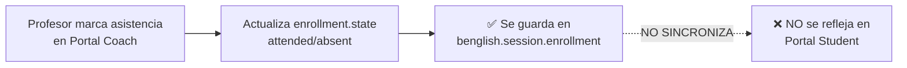
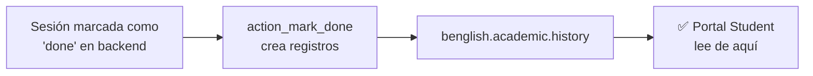
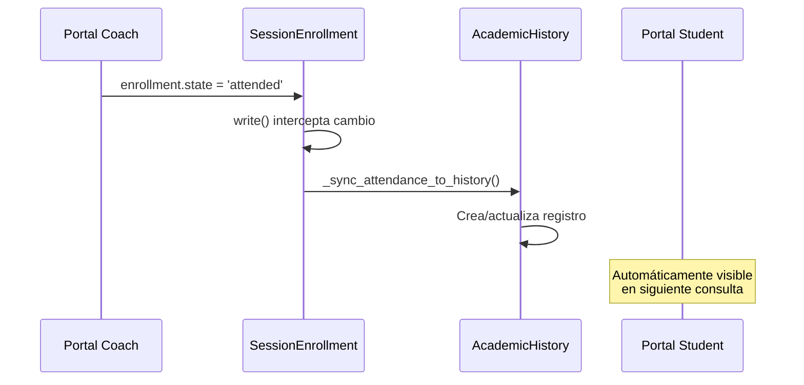
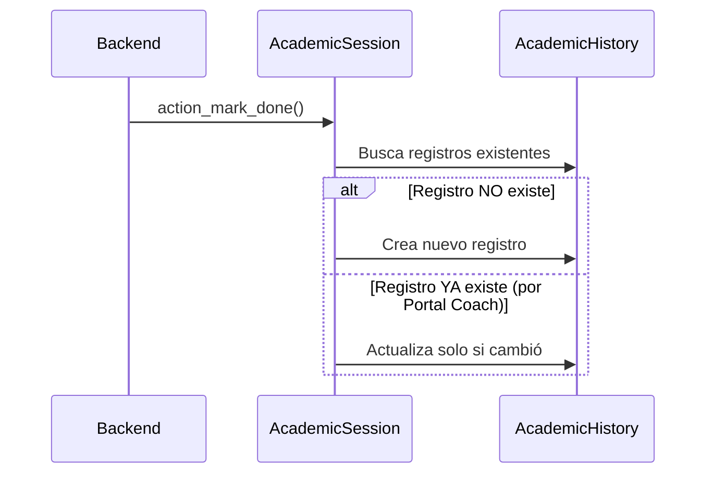
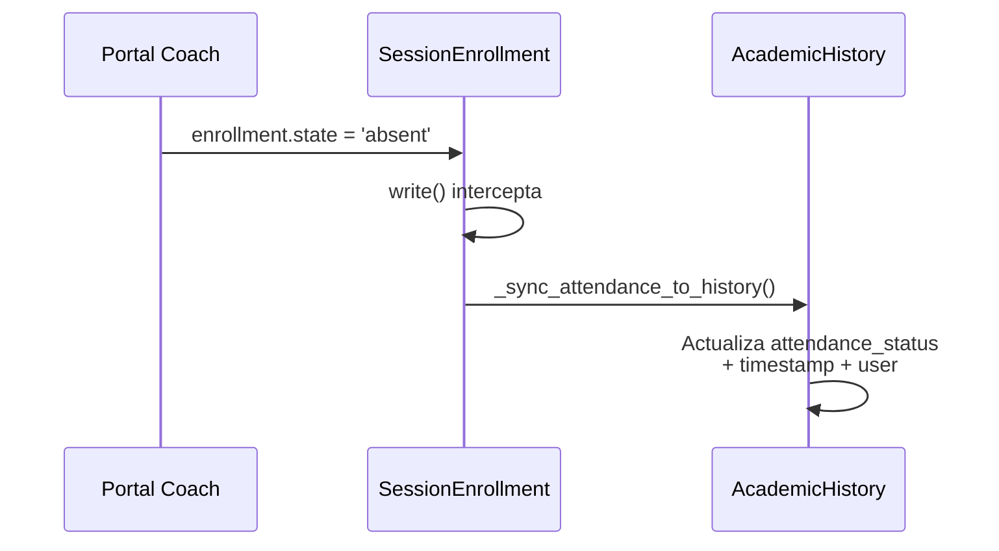

# SOLUCIÓN: SINCRONIZACIÓN PORTAL COACH → PORTAL STUDENT

## 📋 DIAGNÓSTICO DEL PROBLEMA

### Situación Actual

Existen **dos flujos independientes** para registrar asistencia:

#### **Flujo A: Portal Coach → Historia Académica del Estudiante**


**Archivo**: `portal_coach/controllers/portal_coach.py:436`
```python
# El profesor marca asistencia
enrollment.state = 'attended'  # o 'absent'
```

#### **Flujo B: Gestión Académica → Portal Student**


**Archivo**: `benglish_academy/models/academic_session.py:1329`
```python
def action_mark_done(self):
    # Crea registros en benglish.academic.history
    # basándose en enrollment.state
    for enrollment in record.enrollment_ids:
        if enrollment.state == "attended":
            attendance_status = "attended"
        elif enrollment.state == "absent":
            attendance_status = "absent"
        
        History.create({
            "student_id": enrollment.student_id.id,
            "attendance_status": attendance_status,
            # ... más campos
        })
```

### El Problema

**Portal Student** lee de `benglish.academic.history`, que **SOLO** se crea cuando:
- ✅ Una sesión pasa a estado `done` desde Gestión Académica
- ❌ **NO** cuando el profesor marca asistencia desde Portal Coach

**Resultado**: La asistencia marcada en Portal Coach no aparece en Portal Student.

---

## 🎯 OBJETIVO

Que **Portal Student** refleje **automáticamente** la asistencia marcada por el profesor en **Portal Coach**, sin necesidad de marcar la sesión como "dictada" desde Gestión Académica.

---

## 🏗️ ARQUITECTURA DE LA SOLUCIÓN

### Modelo de Datos Unificado

```
┌─────────────────────────────────────────────────────────────┐
│                    FUENTE ÚNICA DE VERDAD                    │
│                benglish.academic.history                     │
│  (Historia Académica Consolidada del Estudiante)            │
└─────────────────────────────────────────────────────────────┘
                           ▲
                           │
                ┌──────────┴──────────┐
                │                     │
        ┌───────▼────────┐   ┌───────▼────────┐
        │ Portal Coach   │   │ Gestión        │
        │ (Profesor)     │   │ Académica      │
        │                │   │ (Backend)      │
        │ Marca          │   │ Marca sesión   │
        │ asistencia     │   │ como 'done'    │
        └───────┬────────┘   └───────┬────────┘
                │                     │
                └──────────┬──────────┘
                           │
                           ▼
        ┌───────────────────────────────────────┐
        │      Portal Student (Estudiante)      │
        │   Lee de benglish.academic.history    │
        └───────────────────────────────────────┘
```

### Principio de Diseño

> **"Write Once, Read Everywhere"**
> - Una sola fuente de verdad: `benglish.academic.history`
> - Todos escriben a través de métodos centralizados
> - Portal Student solo lee (nunca escribe)

---

## 🔧 IMPLEMENTACIÓN TÉCNICA

### Cambio 1: Crear Historial Académico al Marcar Asistencia

**Archivo**: `benglish_academy/models/session_enrollment.py`

**Ubicación**: Método `write()` del modelo `SessionEnrollment`

**Lógica**:
```python
def write(self, vals):
    """
    Intercepta cambios en el estado de inscripción (asistencia).
    Si cambia a 'attended' o 'absent', crea/actualiza el historial académico.
    """
    result = super().write(vals)
    
    # Detectar cambios en el estado de asistencia
    if 'state' in vals and vals['state'] in ['attended', 'absent']:
        for enrollment in self:
            # Verificar que la sesión está en estado válido
            if enrollment.session_id.state in ['started', 'done']:
                # Crear o actualizar historial académico
                enrollment._sync_attendance_to_history()
    
    return result

def _sync_attendance_to_history(self):
    """
    Sincroniza la asistencia del enrollment al historial académico.
    Crea o actualiza el registro correspondiente.
    """
    History = self.env['benglish.academic.history'].sudo()
    
    # Buscar registro existente
    history = History.search([
        ('student_id', '=', self.student_id.id),
        ('session_id', '=', self.session_id.id),
    ], limit=1)
    
    # Mapear estado de enrollment a attendance_status
    attendance_status_map = {
        'attended': 'attended',
        'absent': 'absent',
        'confirmed': 'pending',
        'pending': 'pending',
        'cancelled': 'pending',
    }
    attendance_status = attendance_status_map.get(self.state, 'pending')
    
    if history:
        # Actualizar registro existente
        history.write({
            'attendance_status': attendance_status,
            'attendance_registered_at': fields.Datetime.now(),
            'attendance_registered_by_id': self.env.user.id,
        })
        _logger.info(
            f"[SYNC] Updated history ID={history.id} for Student={self.student_id.name}, "
            f"Session={self.session_id.id}, Attendance={attendance_status}"
        )
    else:
        # Crear nuevo registro
        history_vals = {
            'student_id': self.student_id.id,
            'session_id': self.session_id.id,
            'enrollment_id': self.id,
            'session_date': self.session_id.date,
            'session_time_start': self.session_id.time_start,
            'session_time_end': self.session_id.time_end,
            'program_id': self.session_id.program_id.id,
            'plan_id': self.student_id.plan_id.id if self.student_id.plan_id else False,
            'phase_id': self.student_id.current_phase_id.id if self.student_id.current_phase_id else False,
            'level_id': self.student_id.current_level_id.id if self.student_id.current_level_id else False,
            'subject_id': self.session_id.subject_id.id,
            'campus_id': self.session_id.campus_id.id,
            'teacher_id': self.session_id.teacher_id.id if self.session_id.teacher_id else False,
            'delivery_mode': self.session_id.delivery_mode,
            'attendance_status': attendance_status,
            'attendance_registered_at': fields.Datetime.now(),
            'attendance_registered_by_id': self.env.user.id,
        }
        history = History.create(history_vals)
        _logger.info(
            f"[SYNC] Created history ID={history.id} for Student={self.student_id.name}, "
            f"Session={self.session_id.id}, Attendance={attendance_status}"
        )
    
    return history
```

### Cambio 2: Modificar `action_mark_done` (Idempotencia)

**Archivo**: `benglish_academy/models/academic_session.py`

**Cambio**: Ya existe la lógica de idempotencia, solo asegurar que respete registros existentes.

**Revisión del código existente** (línea 1350):
```python
# Verificar que no exista ya un registro de historial (idempotencia)
existing_history = History.search([
    ("student_id", "=", enrollment.student_id.id),
    ("session_id", "=", record.id),
], limit=1)

if existing_history:
    # Ya existe, solo actualizar asistencia si cambió
    if existing_history.attendance_status != attendance_status:
        existing_history.write({"attendance_status": attendance_status})
    continue
```

✅ **Este código ya está correcto**. Respeta registros creados por Portal Coach.

### Cambio 3: Portal Student NO necesita cambios

**Archivo**: `portal_student/controllers/portal_student.py`

Ya lee de `benglish.academic.history`:
```python
@http.route('/my/student/academic_history', type='http', auth='user', website=True)
def portal_academic_history(self, **kwargs):
    # Obtener historial académico
    History = request.env["benglish.academic.history"].sudo()
    history = History.search([
        ("student_id", "=", student.id)
    ], order="session_date desc, session_time_start desc", limit=100)
    
    # Obtener resumen de asistencia
    attendance_summary = History.get_attendance_summary(student.id)
    # ...
```

✅ **NO requiere cambios**. Automáticamente verá los registros creados.

---

## 📊 CASOS DE USO

### Caso 1: Profesor marca asistencia en sesión activa

**Escenario**: 
- Sesión en estado `started`
- Profesor marca asistencia en Portal Coach

**Flujo**:


### Caso 2: Sesión marcada como dictada desde backend

**Escenario**:
- Sesión en estado `started`
- Administrador marca como `done`

**Flujo**:


### Caso 3: Profesor modifica asistencia después

**Escenario**:
- Ya existe registro en historial
- Profesor cambia `attended` → `absent`

**Flujo**:


---

## ✅ VALIDACIONES Y RESTRICCIONES

### 1. Solo sincronizar sesiones válidas

```python
# En _sync_attendance_to_history()
if self.session_id.state not in ['started', 'done']:
    _logger.warning(
        f"[SYNC] Skipping sync for Session={self.session_id.id} in state={self.session_id.state}"
    )
    return False
```

### 2. Evitar duplicados (constraint único)

**Ya existe** en `benglish.academic.history`:
```python
_sql_constraints = [
    (
        "unique_student_session",
        "UNIQUE(student_id, session_id)",
        "Ya existe un registro de historial para este estudiante en esta sesión.",
    ),
]
```

### 3. Registrar auditoría

Los campos ya existen:
- `attendance_registered_at`: Timestamp
- `attendance_registered_by_id`: Usuario que registró

---

## 🔐 SEGURIDAD Y PERMISOS

### Portal Coach debe poder escribir en historial

**Archivo**: `benglish_academy/security/academic_history_security.xml`

Agregar regla para coaches:

```xml
<!-- Coaches: Pueden crear/actualizar historial de sus sesiones -->
<record id="academic_history_rule_coach" model="ir.rule">
    <field name="name">Academic History: Coaches can manage their sessions</field>
    <field name="model_id" ref="model_benglish_academic_history"/>
    <field name="domain_force">[('teacher_id', '=', user.id)]</field>
    <field name="groups" eval="[(4, ref('benglish_academy.group_benglish_coach'))]"/>
    <field name="perm_read" eval="True"/>
    <field name="perm_write" eval="True"/>
    <field name="perm_create" eval="True"/>
    <field name="perm_unlink" eval="False"/>
</record>
```

---

## 📈 BENEFICIOS DE LA SOLUCIÓN

### 1. **Fuente Única de Verdad**
- Un solo lugar para consultar historial: `benglish.academic.history`
- Elimina inconsistencias entre sistemas

### 2. **Sincronización Automática**
- No requiere intervención manual
- Funciona en tiempo real

### 3. **Idempotencia**
- Puede ejecutarse múltiples veces sin duplicar datos
- Maneja conflictos automáticamente

### 4. **Auditoría Completa**
- Registra quién y cuándo marcó asistencia
- Trazabilidad de cambios

### 5. **Retrocompatibilidad**
- No rompe el flujo existente de Gestión Académica
- Portal Student no necesita cambios

---

## 🧪 PLAN DE PRUEBAS

### Test 1: Profesor marca asistencia en Portal Coach
```
1. Iniciar sesión como profesor
2. Abrir sesión activa en Portal Coach
3. Marcar estudiante como "Asistió"
4. Verificar que enrollment.state = 'attended'
5. Verificar que existe registro en benglish.academic.history
6. Iniciar sesión como estudiante
7. Ir a Portal Student → Historia Académica
8. ✅ VERIFICAR: Aparece la clase con asistencia "Asistió"
```

### Test 2: Modificar asistencia después
```
1. Profesor marca estudiante como "Asistió"
2. Verificar registro en historial
3. Profesor cambia a "Ausente"
4. ✅ VERIFICAR: Registro actualizado (no duplicado)
5. ✅ VERIFICAR: Portal Student muestra "Ausente"
```

### Test 3: Sesión marcada como 'done' con asistencias previas
```
1. Profesor marca asistencias en Portal Coach
2. Administrador marca sesión como 'done'
3. ✅ VERIFICAR: No se duplican registros
4. ✅ VERIFICAR: Se respetan asistencias marcadas por profesor
```

### Test 4: Sesión marcada como 'done' sin asistencias previas
```
1. NO se marca asistencia en Portal Coach
2. Administrador marca sesión como 'done'
3. ✅ VERIFICAR: Se crean registros con attendance_status='pending'
```

---

## 📝 RESUMEN DE ARCHIVOS A MODIFICAR

### 1. **benglish_academy/models/session_enrollment.py**
- ✅ **Agregar**: Método `write()` para interceptar cambios
- ✅ **Agregar**: Método `_sync_attendance_to_history()`
- ✅ **Importar**: `logging` para logs

### 2. **benglish_academy/security/academic_history_security.xml**
- ✅ **Agregar**: Regla de acceso para coaches

### 3. **benglish_academy/models/academic_session.py**
- ✅ **Verificar**: Lógica de idempotencia en `action_mark_done()`
- ℹ️ **No requiere cambios** (ya está correcta)

### 4. **portal_student/controllers/portal_student.py**
- ℹ️ **No requiere cambios** (ya lee de `benglish.academic.history`)

### 5. **portal_coach/controllers/portal_coach.py**
- ℹ️ **No requiere cambios** (ya actualiza `enrollment.state`)

---

## 🚀 PASOS DE IMPLEMENTACIÓN

### Paso 1: Implementar sincronización en SessionEnrollment
```bash
# Editar: benglish_academy/models/session_enrollment.py
```

### Paso 2: Agregar regla de seguridad para coaches
```bash
# Editar: benglish_academy/security/academic_history_security.xml
```

### Paso 3: Actualizar módulo
```bash
# Reiniciar Odoo con actualización
./odoo-bin -c odoo.conf -u benglish_academy
```

### Paso 4: Ejecutar tests
```bash
# Verificar cada caso de uso manualmente
```

### Paso 5: Monitorear logs
```bash
# Buscar entradas con [SYNC] en el log
# Verificar que se crean/actualizan registros correctamente
```

---

## 📚 DOCUMENTACIÓN TÉCNICA

### Modelo: benglish.academic.history

**Propósito**: Registro inmutable de clases dictadas con asistencia del estudiante.

**Campos clave**:
- `student_id`: Estudiante (Many2one)
- `session_id`: Sesión de clase (Many2one)
- `enrollment_id`: Inscripción (Many2one)
- `attendance_status`: 'attended', 'absent', 'pending'
- `attendance_registered_at`: Timestamp
- `attendance_registered_by_id`: Usuario que registró
- `grade`: Calificación (Float)

**Constraint único**:
```sql
UNIQUE(student_id, session_id)
```

### Modelo: benglish.session.enrollment

**Propósito**: Inscripción de estudiante en sesión (relación Many2many).

**Campos clave**:
- `session_id`: Sesión (Many2one)
- `student_id`: Estudiante (Many2one)
- `state`: 'pending', 'confirmed', 'attended', 'absent', 'cancelled'

**Método nuevo**: `_sync_attendance_to_history()`

---

## 🎓 CONCLUSIÓN

Esta solución establece `benglish.academic.history` como la **fuente única de verdad** para el historial académico del estudiante, permitiendo que tanto Portal Coach como Gestión Académica escriban a través de métodos centralizados, y que Portal Student lea consistentemente de un solo lugar.

**Resultado**: La asistencia marcada por el profesor en Portal Coach se refleja automáticamente en Portal Student, sin necesidad de intervención manual.
