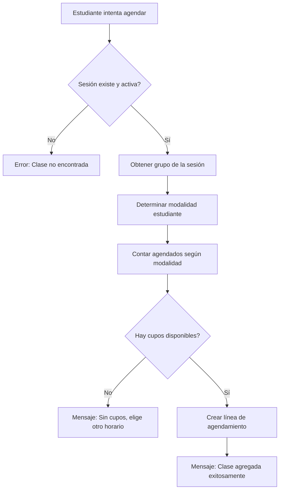

# HU-PE-CUPO-01: Sistema de Validación de Cupos

**Estado:** ✅ IMPLEMENTADO  
**Fecha:** 2025-12-09  
**Módulo:** `portal_student`

---

## 📋 Descripción

Sistema completo de validación de cupos en el portal de estudiante que permite:
- Validar disponibilidad de cupos antes de agendar una clase
- Mostrar mensajes genéricos sin revelar números exactos de capacidad
- Diferenciar capacidad por modalidad (presencial/virtual/híbrido)
- Prevenir sobre-agendamiento de clases

---

## 🎯 Historia de Usuario

**Como** estudiante  
**Quiero** ver solo las clases disponibles para agendar, sin conocer el número de cupos restantes  
**Para** evitar confusiones sobre la cantidad de personas en cada grupo mientras el sistema gestiona internamente la capacidad

---

## 🔧 Implementación Técnica

### 1. Validación de Cupos en Backend

**Archivo:** `controllers/portal_student.py`  
**Método:** `portal_student_add_session()`

```python
# Lógica de validación implementada:

1. Obtener grupo asociado a la sesión
2. Determinar modalidad del estudiante (presencial/virtual/híbrido)
3. Contar estudiantes ya agendados según modalidad
4. Calcular disponibilidad:
   - Presencial: group.presential_capacity - agendados_presenciales
   - Virtual: group.virtual_capacity - agendados_virtuales
   - Híbrido: group.total_capacity - total_agendados
5. Si disponibilidad <= 0: rechazar con mensaje genérico
6. Si disponibilidad > 0: permitir agendamiento
```

**Campos utilizados del modelo `benglish.group`:**
- `presential_capacity`: Capacidad máxima presencial
- `virtual_capacity`: Capacidad máxima virtual
- `total_capacity`: Capacidad total del grupo

---

### 2. Mensajes Genéricos (Sin Revelar Números)

**T-PE-CUPO-01:** Cuando no hay cupo disponible:

```python
{
    "status": "error",
    "message": (
        "Esta clase ya no tiene cupos disponibles. "
        "Por favor, elige otro horario para esta asignatura. "
        "Puedes consultar otras opciones en la agenda publicada."
    ),
    "no_capacity": True
}
```

**Características:**
- ❌ NO muestra: "Quedan 2 cupos de 30"
- ✅ SÍ muestra: "Esta clase ya no tiene cupos disponibles"
- ✅ Sugiere alternativas al estudiante
- ✅ Flag `no_capacity` para manejo especial en frontend

---

### 3. Manejo en Frontend (JavaScript)

**Archivo:** `views/portal_student_templates.xml`

```javascript
// Detección de mensaje de cupo agotado
if (result.no_capacity) {
    showToast('warning', result.message);
} else {
    showToast('error', result.message);
}
```

**Toast de advertencia:**
- Color naranja/amarillo
- Ícono de advertencia
- Mensaje claro y útil

---

## 📊 Flujo de Validación



---

## 🔒 Privacidad de Datos

### ✅ Lo que el estudiante VE:
- "Esta clase está disponible" (botón habilitado)
- "Esta clase ya no tiene cupos disponibles" (cuando lleno)
- Sugerencias de acción

### ❌ Lo que el estudiante NO VE:
- Número exacto de cupos disponibles
- Capacidad total del grupo
- Cuántas personas están inscritas
- Comparativas entre grupos

---

## 🧪 Casos de Prueba

### Caso 1: Clase con cupos disponibles
```
DADO: Grupo con capacidad 20, 15 agendados
CUANDO: Estudiante intenta agendar
ENTONCES: Agendamiento exitoso, mensaje: "Clase agregada exitosamente"
```

### Caso 2: Clase sin cupos (modalidad presencial)
```
DADO: Grupo con capacidad presencial 10, 10 agendados presenciales
CUANDO: Estudiante presencial intenta agendar
ENTONCES: Rechazo con mensaje genérico sin números
```

### Caso 3: Clase sin cupos (modalidad virtual)
```
DADO: Grupo con capacidad virtual 15, 15 agendados virtuales
CUANDO: Estudiante virtual intenta agendar
ENTONCES: Rechazo con mensaje genérico
```

### Caso 4: Clase con cupos virtuales pero llenos presenciales
```
DADO: 
  - Capacidad presencial: 10 (lleno)
  - Capacidad virtual: 20 (5 agendados)
CUANDO: Estudiante virtual intenta agendar
ENTONCES: Agendamiento exitoso (hay cupos virtuales)
```

---

## 📝 Consideraciones Importantes

1. **Separación por modalidad:** El sistema respeta las capacidades diferenciadas entre presencial y virtual

2. **Race conditions:** Se valida en el momento de creación, pero existe validación adicional en el modelo

3. **Mensaje amigable:** Los mensajes guían al estudiante hacia alternativas sin frustrarlo

4. **Compatibilidad futura:** El sistema está preparado para cuando tu compañero rediseñe la agenda

---

## 🚀 Mejoras Futuras Sugeridas

1. **Pre-validación visual:** Deshabilitar botón "Agendar" si no hay cupos (requiere consulta previa)
2. **Indicador de popularidad:** Mostrar "Muy solicitada" en lugar de números
3. **Lista de espera:** Permitir inscribirse en lista de espera cuando esté lleno
4. **Notificaciones:** Alertar cuando se libere un cupo

---

## 📚 Referencias

- **HU-PE-CUPO-01:** Historia de usuario principal
- **T-PE-CUPO-01:** Tarea técnica de mensajes genéricos
- **Modelo `benglish.group`:** Campos de capacidad
- **Modelo `portal.student.weekly.plan.line`:** Líneas de agendamiento

---

## ✅ Checklist de Implementación

- [x] Validación de cupos en backend
- [x] Mensajes genéricos sin números
- [x] Diferenciación por modalidad
- [x] Manejo de errores en frontend
- [x] Estilos de toast warning
- [x] Documentación técnica
- [x] Casos de prueba definidos

---

## 👨‍💻 Desarrollado por

**Mateo Noreña - 2025**
